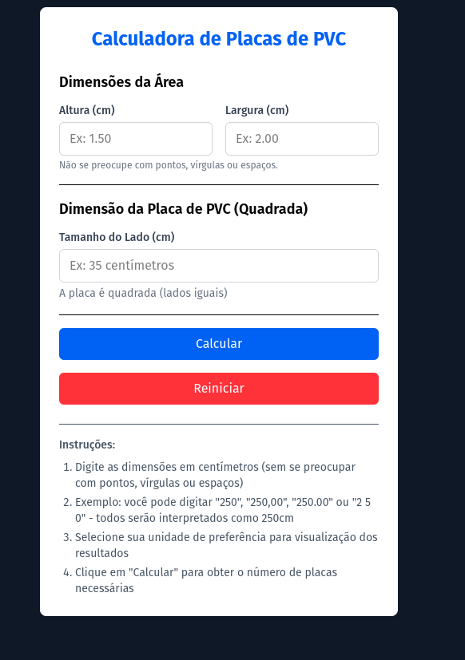

<h1 align="center" style="text-align: center;">
  📄 Calculadora de Placas de PVC
</h1>

<div align="center">
    
</div>

<h2 id="project">📁 Projeto</h2>

<p>
Este projeto nasceu de uma necessidade prática: ajudar um amigo que planejava instalar placas de PVC em sua parede mas enfrentava dificuldades para calcular a quantidade exata de material necessário. A dúvida comum - "Quantas placas preciso comprar?"
</p>

## A Solução:
- Desenvolvemos uma calculadora inteligente que transforma esses cálculos complexos em uma experiência simples:

- Interface intuitiva para inserção das medidas

- Cálculo instantâneo considerando formato quadrado das placas

- Conversão automática entre centímetros e metros quadrados

- Resultados detalhados com métricas claras

## Destaques Técnicos:

- Formatação inteligente de decimais durante a digitação

- Validação em tempo real das entradas

- Algoritmo preciso de arredondamento

- Visualização bidimensional das placas

- Responsividade para uso em dispositivos móveis

## Como Ajuda Usuários:
##### ✔️ Elimina erros de cálculo humano
##### ✔️ Economiza tempo no planejamento de obras
##### ✔️ Reduz desperdício de material
##### ✔️ Facilita comparação entre diferentes tamanhos de placas
##### ✔️ Fornece relatório técnico instantâneo

## Tecnologia Utilizada:

 - React + TypeScript para lógica precisa

- Tailwind CSS para design responsivo

-  Cálculos vetoriais para precisão milimétrica

- Sistema de conversão de unidades integrado

## Para Quem é Indicado:

- Profissionais de pequenas obras

- Estudantes de arquitetura e design de interiores

- Loja de materiais de construção (como ferramenta para clientes)

#### Este projeto vai além de uma simples calculadora - é uma ponte entre o planejamento teórico e a execução prática em projetos de revestimento, garantindo economia e eficiência desde o primeiro passo da reforma.

<h2 id="site">⭐ Site</h2>

O site está disponível no seguinte endereço [aqui](https://calculadora-placas-pw8q45esp-pcaldis-projects.vercel.app/).

## Como Usar

### Pré-requisitos
- Node.js (v18 ou superior)
- npm (v9 ou superior)

### Instalação
```bash
# Clonar repositório
git clone https://github.com/seu-usuario/calculadora_placas_pvc.git

# Instalar dependências
npm install

# Iniciar aplicação
npm run dev

```


## 👨🏻‍💻 Autor

<a href="https://github.com/pcaldi">
 
 <br />
 <sub><b>Paulo Caldi</b></sub></a> <a href="https://github.com/pcaldi" title="emoji">🙋🏻</a>
 <br />

[](https://www.linkedin.com/in/pcaldi/)
[](mailto:pcaldi@gmail.com)


---
